# 🎬 Producción de Contenido Automatizada con IA

Sistema modular que **usa LLM (Gemini/GPT) para analizar transcripciones** y transformar videos largos en contenido optimizado para múltiples plataformas.

## 🔑 Características Clave

- ✅ **Entrada: TXT con transcripción** (NO transcribe, ya tienes el archivo)
- ✅ **Análisis con LLM**: Gemini/GPT identifica automáticamente qué segmentos resaltar
- ✅ **Cortes inteligentes**: El LLM sugiere timestamps basados en contenido valioso
- ✅ **Edición automatizada**: Cortar, limpiar audio, normalizar volumen
- ✅ **Multiplicación multi-plataforma**: 16:9, 9:16, 1:1 en un solo paso

## 🎯 Flujo de Trabajo

```mermaid
flowchart TD
    txt[📝 TXT Transcripción] --> llm[🤖 LLM Analiza]
    video[🎥 Video Original] --> paso2
    llm --> segmentos[✂️ Segmentos Sugeridos]
    segmentos --> ajustes[👤 Revisión Manual]
    ajustes --> paso2[PASO 2: Edición]
    paso2 --> cortes[Cortar Clips]
    cortes --> limpieza[Limpiar Audio]
    limpieza --> normalizar[Normalizar -14 LUFS]
    normalizar --> master[🎬 Video Master]
    master --> paso3[PASO 3: Multiplicación]
    paso3 --> youtube[📺 YouTube 16:9]
    paso3 --> tiktok[📱 TikTok 9:16]
    paso3 --> instagram[📸 Instagram 1:1]
```



## 📁 Estructura del Proyecto

```
contenido-automatico/
├── src/                      # Módulos Python
│   ├── analisis.py          # Análisis de transcripción
│   ├── transcripcion.py     # Whisper transcription
│   ├── edicion.py           # FFmpeg video editing
│   ├── utils.py             # Utilidades generales
│   └── requirements.txt     # Dependencias
├── notebooks/               # Jupyter notebooks
│   └── produccion_contenido.ipynb  # Notebook principal para Colab
├── docs/                    # Documentación
│   ├── PLANTILLA_ANALISIS.md      # Template de análisis
│   ├── CHECKLIST_QC.md            # Control de calidad
│   ├── COMANDOS_EDICION.md        # Referencia FFmpeg/MoviePy
│   └── REQUISITOS_MULTIPLICADOR.md # Specs del multiplicador
├── samples/                 # Videos de ejemplo
└── output/                  # Resultados (no en git)
```

## 🚀 Uso en Google Colab

### Opción 1: Abrir Notebook Directo

[](https://colab.research.google.com/github/tu-usuario/contenido-automatico/blob/main/notebooks/produccion_contenido.ipynb)

### Opción 2: Manual

1. Abre [Google Colab](https://colab.research.google.com/)
2. Habilita GPU: `Runtime` → `Change runtime type` → `GPU`
3. Ejecuta las celdas en orden

El notebook te guiará paso a paso:
- ✅ Instalación automática de dependencias
- ✅ Montaje de Google Drive
- ✅ **Análisis con LLM (Gemini)** - Lee TXT y sugiere cortes inteligentes
- ✅ Edición de video - Corta según análisis del LLM
- ✅ Multiplicación de contenido - Múltiples formatos

### ⚠️ Requisitos del Notebook
- **API Key de Gemini**: Necesitas una API key gratuita de Google AI Studio
  - 📖 **[Guía completa: Cómo obtener tu API key](docs/SETUP_GEMINI.md)**
- **Archivos de entrada**:
  - Video original (MP4)
  - Transcripción (TXT con timestamps en formato `MM:SS Nombre: Texto`)

## 🛠️ Instalación Local

```bash
# Clonar repo
git clone https://github.com/tu-usuario/contenido-automatico.git
cd contenido-automatico

# Instalar dependencias
pip install -r src/requirements.txt

# Instalar FFmpeg (si no está instalado)
# En Ubuntu/Debian:
sudo apt install ffmpeg

# En macOS:
brew install ffmpeg

# En Windows:
# Descargar desde https://ffmpeg.org/download.html
```

## 📚 Módulos Disponibles

### `src/transcripcion.py`

```python
from src.transcripcion import transcribir_audio

resultado = transcribir_audio("audio.wav", model_size="base")
print(resultado['texto_completo'])
print(resultado['palabras'])  # Con timestamps
```

### `src/analisis.py` (Opcional - el notebook usa LLM directamente)

```python
from src.analisis import analizar_transcripcion, crear_shotlist

# Analizar transcripción (detección básica de silencios)
analisis = analizar_transcripcion(palabras)

# Nota: El notebook usa un LLM (Gemini/GPT) para análisis inteligente
# Este módulo es para uso local sin LLM
```

### `src/edicion.py`

```python
from src.edicion import (
    extraer_audio,
    cortar_video,
    concatenar_clips,
    normalizar_audio_video,
    reducir_ruido_basico,
    export_multi_ratio
)

# Extraer audio
audio = extraer_audio("video.mp4")

# Cortar clip
clip = cortar_video("video.mp4", inicio=10, fin=30)

# Normalizar audio
normalizar_audio_video("video.mp4", "output.mp4", target_lufs=-14)

# Export multi-ratio
variantes = export_multi_ratio("master.mp4", "output/", ratios=['16:9', '9:16', '1:1'])
```

## 📖 Documentación

- **[SETUP_GEMINI.md](docs/SETUP_GEMINI.md)**: 🔑 Cómo obtener y configurar tu API key de Gemini (GRATIS)
- **[PLANTILLA_ANALISIS.md](docs/PLANTILLA_ANALISIS.md)**: Template completo para analizar transcripciones y crear shotlists
- **[CHECKLIST_QC.md](docs/CHECKLIST_QC.md)**: Checklist de control de calidad para videos editados
- **[COMANDOS_EDICION.md](docs/COMANDOS_EDICION.md)**: Referencia de comandos FFmpeg y MoviePy
- **[REQUISITOS_MULTIPLICADOR.md](docs/REQUISITOS_MULTIPLICADOR.md)**: Especificaciones del motor multiplicador

## 🎬 Flujo Completo de Ejemplo

### Con LLM (Recomendado - ver notebook)

El notebook `produccion_contenido.ipynb` usa **Gemini** para:
1. Leer transcripción TXT
2. Analizar con LLM qué segmentos son valiosos
3. Sugerir timestamps automáticamente
4. Editar video según análisis inteligente

### Sin LLM (Uso local programático)

```python
from pathlib import Path
from src.edicion import cortar_video, concatenar_clips, normalizar_audio_video, export_multi_ratio

# Paso 1: Definir cortes manualmente (análisis manual de transcripción)
cortes_manuales = [
    (163, 524),   # 02:43 - 08:44 - Segmento interesante 1
    (847, 1320),  # 14:07 - 22:00 - Segmento interesante 2
]

# Paso 2: Edición
clips = []
for idx, (inicio, fin) in enumerate(cortes_manuales):
    clip = cortar_video("video.mp4", inicio=inicio, fin=fin, 
                       output_path=f"clip_{idx}.mp4")
    clips.append(clip)

video_editado = concatenar_clips(clips, "editado.mp4")
video_master = normalizar_audio_video(video_editado, "master.mp4", target_lufs=-14)

# Paso 3: Multiplicación
variantes = export_multi_ratio(video_master, "output/", ratios=['16:9', '9:16', '1:1'])

print("✅ Contenido listo para:")
for ratio, path in variantes.items():
    print(f"  {ratio}: {path}")
```

## 🤝 Contribuir

1. Fork el repo
2. Crea una rama (`git checkout -b feature/nueva-funcionalidad`)
3. Commit tus cambios (`git commit -am 'Agregar funcionalidad'`)
4. Push a la rama (`git push origin feature/nueva-funcionalidad`)
5. Abre un Pull Request

## 📝 Licencia

MIT License - ver [LICENSE](LICENSE) para más detalles.

## 🙋 Soporte

¿Problemas o preguntas? Abre un [Issue](https://github.com/tu-usuario/contenido-automatico/issues)
