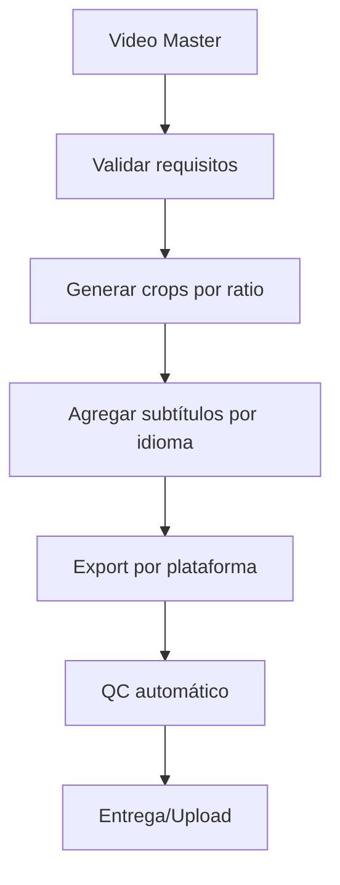

# Requisitos del Motor Multiplicador de Contenido

Este documento define los requisitos y especificaciones para los archivos que entran al motor multiplicador.

---

## 1. Archivos de Entrada

### 1.1 Video Master

El video master es el archivo principal editado y aprobado por QC.

| Especificación | Valor Requerido |
|----------------|-----------------|
| **Formato** | MP4 (H.264) o MOV (ProRes) |
| **Resolución mínima** | 1920x1080 (1080p) |
| **Resolución recomendada** | 3840x2160 (4K) |
| **Frame rate** | 30fps o 60fps |
| **Codec video** | H.264 (libx264) o ProRes |
| **Codec audio** | AAC o PCM |
| **Loudness** | -14 LUFS (normalizado) |
| **Sample rate audio** | 48000 Hz |

### 1.2 Archivos Stem (Opcionales pero Recomendados)

Para mayor flexibilidad en la multiplicación:

| Stem | Descripción | Formato |
|------|-------------|---------|
| **Voz principal** | Solo la voz/narración | WAV 48kHz 16-bit |
| **Música de fondo** | Solo música | WAV 48kHz 16-bit |
| **SFX** | Efectos de sonido | WAV 48kHz 16-bit |
| **Video sin audio** | Video limpio | MP4/MOV |

### 1.3 Assets Adicionales

| Asset | Formato | Notas |
|-------|---------|-------|
| **Subtítulos** | SRT o VTT | Sincronizados con el video |
| **Transcripción** | TXT o JSON | Con marcas de tiempo |
| **Thumbnails** | PNG 1280x720 | Sin texto (texto se agrega por variante) |
| **Gráficos/Overlays** | PNG con alpha | Resolución igual o mayor al video |

---

## 2. Variantes de Salida

### 2.1 Por Plataforma

| Plataforma | Aspect Ratio | Resolución | Duración máx | Notas |
|------------|--------------|------------|--------------|-------|
| YouTube | 16:9 | 1920x1080+ | Sin límite | Horizontal estándar |
| YouTube Shorts | 9:16 | 1080x1920 | 60s | Vertical |
| TikTok | 9:16 | 1080x1920 | 10 min | Vertical |
| Instagram Reels | 9:16 | 1080x1920 | 90s | Vertical |
| Instagram Feed | 1:1 o 4:5 | 1080x1080 / 1080x1350 | 60s | Cuadrado o vertical |
| Instagram Stories | 9:16 | 1080x1920 | 15s por historia | Vertical |
| Facebook | 16:9 o 1:1 | 1920x1080 / 1080x1080 | Sin límite | Ambos formatos |
| LinkedIn | 16:9 o 1:1 | 1920x1080 / 1080x1080 | 10 min | Profesional |
| Twitter/X | 16:9 o 1:1 | 1920x1080 / 1080x1080 | 2:20 min | Corto |

### 2.2 Por Idioma

| Idioma | Código | Requiere |
|--------|--------|----------|
| Español (original) | es | Subtítulos SRT |
| Inglés | en | Subtítulos SRT + Audio doblado (opcional) |
| Portugués | pt | Subtítulos SRT + Audio doblado (opcional) |

### 2.3 Matriz de Variantes

Para cada video master, generar:

```
master.mp4
├── youtube/
│   ├── es/
│   │   ├── video_16x9.mp4
│   │   └── video_16x9_subtitulado.mp4
│   └── en/
│       ├── video_16x9.mp4
│       └── video_16x9_subtitulado.mp4
├── shorts/
│   ├── es/
│   │   └── video_9x16.mp4
│   └── en/
│       └── video_9x16.mp4
├── reels/
│   └── ...
├── tiktok/
│   └── ...
└── thumbnails/
    ├── thumb_es.png
    └── thumb_en.png
```

---

## 3. Especificaciones de Export

### 3.1 Configuración por Defecto

```bash
# Video para streaming (YouTube, TikTok, etc.)
ffmpeg -i master.mp4 \
  -c:v libx264 \
  -preset slow \
  -crf 20 \
  -profile:v high \
  -level 4.1 \
  -pix_fmt yuv420p \
  -c:a aac \
  -b:a 256k \
  -ar 48000 \
  -movflags +faststart \
  output.mp4
```

### 3.2 Bitrate Recomendado por Resolución

| Resolución | Bitrate Video | Bitrate Audio |
|------------|---------------|---------------|
| 4K (2160p) | 35-45 Mbps | 384 kbps |
| 1080p | 8-12 Mbps | 256 kbps |
| 720p | 5-7 Mbps | 192 kbps |

---

## 4. Proceso de Multiplicación

### 4.1 Flujo



### 4.2 Checklist Pre-Multiplicación

- [ ] Video master cumple especificaciones (resolución, loudness, codec)
- [ ] Subtítulos disponibles y sincronizados
- [ ] Transcripción verificada
- [ ] Thumbnails base disponibles
- [ ] Assets adicionales en formatos correctos

### 4.3 Validaciones Automáticas

El motor debe validar automáticamente:

1. **Resolución**: Suficiente para los crops requeridos
2. **Duración**: Apropiada para cada plataforma
3. **Audio**: Loudness normalizado (-14 LUFS ± 1)
4. **Subtítulos**: Formato válido y sincronizado
5. **Espacio en disco**: Suficiente para todas las variantes

---

## 5. Metadata

### 5.1 Información Requerida por Video

```json
{
  "id": "video_001",
  "titulo": {
    "es": "Título en español",
    "en": "Title in English"
  },
  "descripcion": {
    "es": "Descripción...",
    "en": "Description..."
  },
  "tags": ["tag1", "tag2", "tag3"],
  "categoria": "educacion",
  "fecha_publicacion": "2024-01-15",
  "plataformas_destino": ["youtube", "tiktok", "instagram"],
  "idiomas": ["es", "en"],
  "duracion_original": 180,
  "archivo_master": "master.mp4",
  "subtitulos": {
    "es": "subs_es.srt",
    "en": "subs_en.srt"
  }
}
```

### 5.2 Naming Convention

```
{proyecto}_{plataforma}_{ratio}_{idioma}_{version}.{ext}

Ejemplos:
- tutorial_youtube_16x9_es_v1.mp4
- tutorial_tiktok_9x16_en_v1.mp4
- tutorial_instagram_1x1_es_v1.mp4
```

---

## 6. Errores Comunes y Soluciones

| Error | Causa | Solución |
|-------|-------|----------|
| Crop corta contenido importante | Sujeto no centrado | Re-editar con sujeto centrado o usar tracking manual |
| Audio muy bajo/alto en variante | No se normalizó el master | Aplicar loudnorm al master antes de multiplicar |
| Subtítulos desincronizados | Offset en SRT | Verificar sync en master antes de generar variantes |
| Archivo muy pesado | CRF muy bajo | Usar CRF 20-23 para streaming |
| Video pixelado | Upscaling de fuente baja res | Usar resolución nativa o menor, no upscalear |

---

## 7. Integración con Herramientas

### 7.1 Scripts Disponibles

| Script | Función |
|--------|---------|
| `validate_master.py` | Valida que el master cumple requisitos |
| `generate_crops.py` | Genera todos los crops de un master |
| `add_subtitles.py` | Agrega subtítulos hardcoded o softcoded |
| `batch_export.py` | Export masivo con configuración por plataforma |
| `upload_manager.py` | Gestiona uploads a múltiples plataformas |

### 7.2 Configuración

```yaml
# config/multiplicador.yaml
default_output_dir: "./output/variantes"
platforms:
  youtube:
    ratio: "16:9"
    resolution: "1920x1080"
    max_duration: null
  tiktok:
    ratio: "9:16"
    resolution: "1080x1920"
    max_duration: 600
  instagram_reels:
    ratio: "9:16"
    resolution: "1080x1920"
    max_duration: 90
languages:
  - es
  - en
export:
  codec: "libx264"
  crf: 20
  audio_bitrate: "256k"
```

---

## Notas Finales

- Siempre trabajar desde el video master de mayor calidad disponible
- Mantener archivos stem separados para máxima flexibilidad
- Validar automáticamente antes de cada proceso de multiplicación
- Documentar cualquier excepción o caso especial en el proyecto

